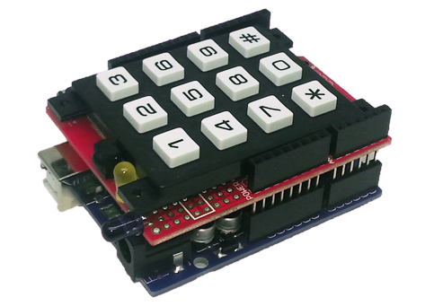
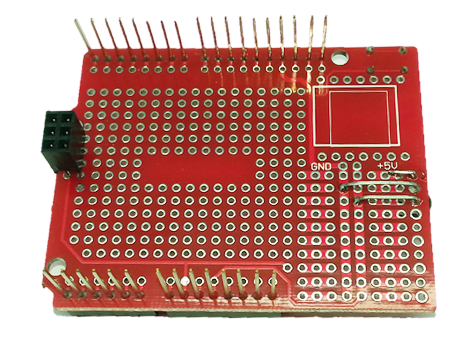
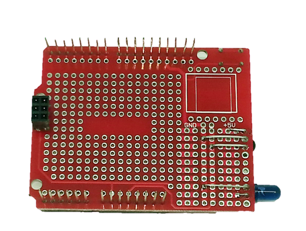
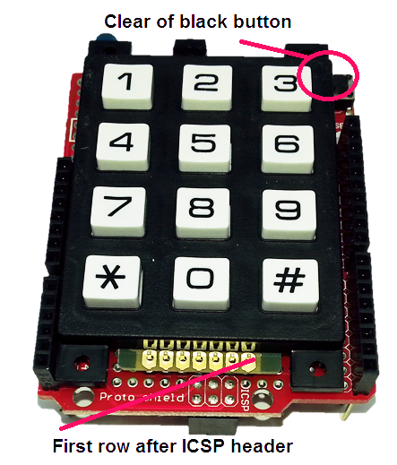
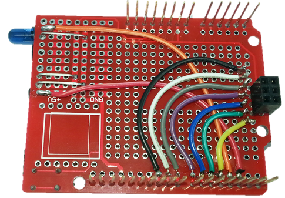
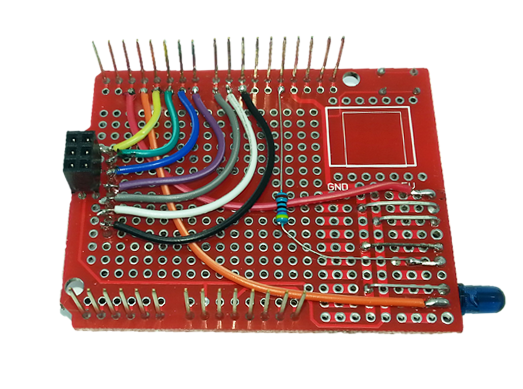
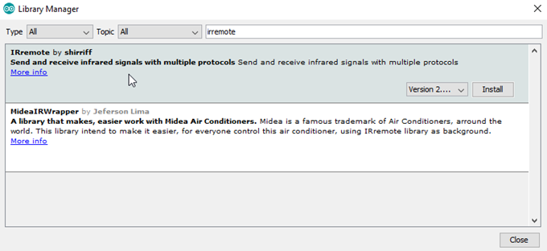

# Programmable Remote Control

One of the really great things about the Arduino community is how many extra features they have added to the IDE. In this project, we'll be using a library which has been created by one of the members of the Arduino community, and has been added to by other members. It's a Programmable Remote Control, which is perhaps similar to a 'Learning Remote Control', except that it can give a lot more information about the codes it is sending. Check out the library documentation for the protocols that are supported. Some soldering required!

## Shopping List

|Qty| Code | Description |
|---|---|---|
|1 | [XC4410](http://jaycar.com.au/p/XC4410) | uno main board
|1 | [XC4482](http://jaycar.com.au/p/XC4482) | prototyping shield
|1 | [HM3211](http://jaycar.com.au/p/HM3211) | 28 way header strip
|1 | [RR0564](http://jaycar.com.au/p/RR0564) | 470 ohm resistors
|1 | [SP0770](http://jaycar.com.au/p/SP0770) | matrix keypad
|1 | [ZD1953](http://jaycar.com.au/p/ZD1953) | IR receiver
|1 | [ZD1945](http://jaycar.com.au/p/ZD1945) | 5mm IR led
|1 | [ZD0160](http://jaycar.com.au/p/ZD0160) | yellow IR led

You'll also need some offcuts of wire to build the project- we used some coloured ribbon cable offcuts to help identify which wire is which.

## Construction:

Start with the IR Receiver (this is the one with three legs) and the Prototyping Shield, and solder the IR in place with the lens facing away from the board, but do not trim the legs. Carefully bend the legs over underneath the board and solder them to the other pads as shown. This simplifies our wiring by using the 5V and GND buses that are on the board. Note that the middle leg goes to GND

Similarly, wire in the IR LED, ensuring that the side with the flat goes to GND.

The next step is to mount the Matrix Keypad on a strip of seven from the Header Strip, and fit this onto the Prototyping Shield. This may be a bit tight, and you'll need to make sure that the Matrix Keypad doesn't rest on top of the Reset button on the Prototyping Shield.

Once you have located the Keypad Matrix, solder the Header Strip in place. Flip the Prototyping Shield over and solder the connecting wires in place.

The connections are as follows (note that the Keypad terminals are numbered 1-7 when viewed from the front):

|Prototyping Shield/ Uno |Component Connection
|--- |---
|D2 |IR Receiver
|D3 |IR LED
|D4 |Keypad 7
|D5 |Keypad 6
|D6 |Keypad 5
|D7 |Keypad 4
|D8 |Keypad 3
|D9 |Keypad 2
|D10 |Keypad 1
|5V |IR Receiver (positive supply)
|GND |IR receiver and IR LED grounds

Another component we added at the last minute is the yellow LED as a status indicator. It goes to between D13 and GND via the 470 Ohm resistor as seen below. It is mounted in a similar fashion to the other LEDs, but facing upwards so it can be seen from the same angle as the keypad.

Finally, attach the completed shield to the Uno.

## Code:

As we noted at the start, we're using a library, and fortunately this library can be installed via the Library Manager. Search for 'irremote', and install the top entry as seen below. We have been using version 1.0.0 (the dropdown box next to the install button lets you choose the version), as there appeared to be issues with the latest version.

The next step is to connect the Uno to the computer via USB, select the 'Uno' board and correct serial port, then open and upload the sketch. The sketch won't show any obvious signs of doing anything, but you can open the Serial Monitor to see the debug data.

## Usage:

The Programmable Remote Control can work in two different ways. When connected to the computer with the Serial Monitor open, the learning mode can be activated by typing into the Serial Monitor the button that needs to be programmed. You will know if learning mode is active by the yellow LED lighting up. The Serial Monitor will display information about the next IR signal it receives, and saves the code to EEPROM. Pressing a button on the actual Keypad Matrix will trigger the transmission of a code and cause the LED to flicker. If the Serial Monitor is connected, information about the code will be displayed as it is sent.

For usage away from a computer, hold down the button you want to program, then press the reset button on the Prototyping Shield. When the LED turns solid yellow, the Programmable Remote Control is ready to learn the next IR signal it receives, and will save it under the button that was being held. If you want to capture codes and examine them later, you can use the Serial Monitor to play them back.

## Improvements:

The hardware is a handy combination, and can be used in a few different ways, because it has a receiver and transmitter. You could have a completely different sketch that can receive one signal, and then activate some other signals- for example, to turn on the amplifier at the same time as the stereo.

Alternatively, it could be used as a scanner for a remote control. The library has some documentation of the codes it uses, so even if you are missing the original remote control, you could write an Arduino sketch that scans through the codes until it finds one that works.
